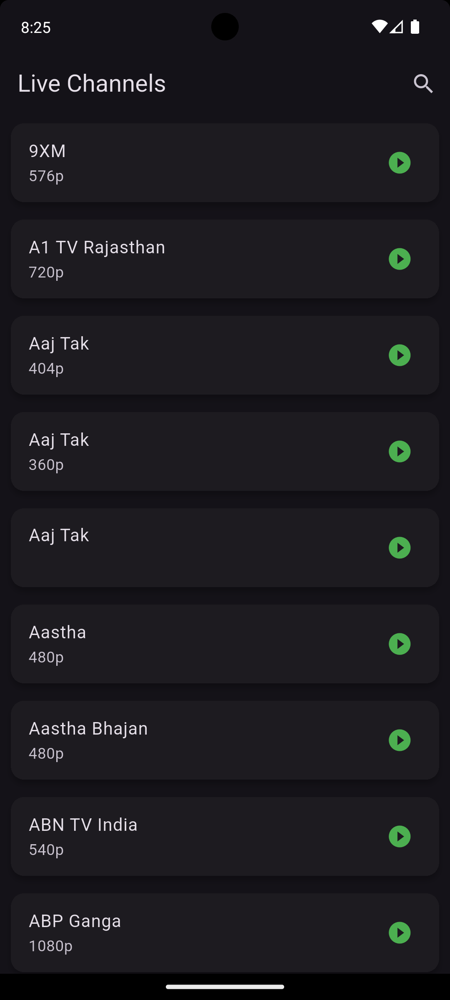

# 📺 IPTV Player

A modern, feature-rich IPTV streaming application built with Flutter. Stream live TV channels with professional video controls and an intuitive user interface.

## 🎥 Demo

Watch the app in action: **[Demo Video](https://drive.google.com/file/d/10zAdbpsQstCAltDd2CGakzxHbuGZRk2m/view?usp=sharing)**

## ✨ Features

### 🚀 Core Features

- **Live TV Streaming**: Stream IPTV channels from JSON data source
- **Search Functionality**: Real-time channel search with instant filtering
- **Professional Video Player**: Custom video player with comprehensive controls
- **Splash Screen**: Animated splash screen with 3-second loading

### 🎮 Video Player Controls

- **Play/Pause**: Large, responsive play/pause button
- **Aspect Ratio Control**: Switch between 16:9, 4:3, 21:9, 1:1, and Auto
- **Video Fit Options**: Toggle between Fit to Screen and Fill Screen modes
- **Fullscreen Mode**: Immersive fullscreen experience
- **Screen Rotation**: Manual portrait/landscape switching
- **Screen Lock**: Lock screen to prevent accidental touches
- **Auto-hide Controls**: Controls automatically hide after 3 seconds

### 🔒 Advanced Controls

- **Screen Lock System**:
  - Tap lock button to lock screen
  - Tap screen when locked to show unlock overlay
  - Unlock overlay auto-hides after 3 seconds
- **Smart Navigation**: Custom back button with proper system cleanup
- **Orientation Management**: Automatic orientation handling
- **Visual Feedback**: Real-time feedback for all control actions

### 🎨 User Interface

- **Dark Theme**: Modern dark theme throughout the app
- **Channel Cards**: Beautiful channel list with quality indicators
- **Search Interface**: Integrated search with result counter
- **Loading States**: Smooth loading animations and progress indicators
- **Gradient Overlays**: Professional video control overlays

## 📱 Screenshots

| Splash Screen                                                              | Channel List                                                             | Search                                                       | Video Player                                                             |
| -------------------------------------------------------------------------- | ------------------------------------------------------------------------ | ------------------------------------------------------------ | ------------------------------------------------------------------------ |
|  |  |  |  |
| Animated loading with IPTV branding                                        | Searchable channel list                                                  | Real-time search filtering                                   | Professional video controls                                              |


## 🛠️ Technical Stack

- **Framework**: Flutter
- **Language**: Dart
- **Video Player**: video_player package
- **State Management**: StatefulWidget with setState
- **Platform**: Android/iOS compatible
- **Architecture**: Clean, modular code structure

## 📁 Project Structure

```
lib/
├── main.dart                 # App entry point
├── splash_screen.dart        # Animated splash screen
├── channel_list_screen.dart  # Channel list with search
├── video_player_screen.dart  # Advanced video player
└── model/
    └── json_conversion_model.dart # Data models
assets/
└── hindi_india_streams.json  # Channel data source
```

## 🚀 Getting Started

### Prerequisites

- Flutter SDK (>=3.0.0)
- Dart SDK (>=2.17.0)
- Android Studio / VS Code
- Git

### Local Development Setup

1. **Clone the Repository**

   ```bash
   git clone https://github.com/kunal7236/iptv_player.git
   cd iptv_player
   ```

2. **Install Dependencies**

   ```bash
   flutter pub get
   ```

3. **Run the App**

   ```bash
   # Debug mode
   flutter run

   # Release mode
   flutter run --release
   ```

4. **Build APK (Android)**

   ```bash
   flutter build apk --release
   ```

5. **Build for iOS**
   ```bash
   flutter build ios --release
   ```

### 🔧 Configuration

#### Channel Data

Update the channel data in `assets/hindi_india_streams.json`:

```json
[
  {
    "channel": "Channel.Name",
    "title": "Display Name",
    "url": "https://stream-url.m3u8",
    "quality": "720p",
    "user_agent": null,
    "referrer": null
  }
]
```

#### App Settings

Modify app settings in `lib/main.dart`:

- App title
- Theme configuration
- Debug banner settings

## 🤝 Contributing

We welcome contributions! Here's how you can help:

### Ways to Contribute

1. **🐛 Bug Reports**
   - Report bugs via GitHub Issues
   - Include device info, Flutter version, and reproduction steps
2. **✨ Feature Requests**
   - Suggest new features through GitHub Issues
   - Describe the feature and its use case
3. **💻 Code Contributions**
   - Fork the repository
   - Create a feature branch
   - Make your changes
   - Submit a pull request

### Development Guidelines

#### Code Style

- Follow Flutter/Dart style guidelines
- Use meaningful variable and function names
- Add comments for complex logic
- Maintain consistent formatting

#### Pull Request Process

1. **Fork & Branch**

   ```bash
   git fork https://github.com/kunal7236/iptv_player.git
   git checkout -b feature/your-feature-name
   ```

2. **Make Changes**

   - Write clean, documented code
   - Test your changes thoroughly
   - Update documentation if needed

3. **Commit & Push**

   ```bash
   git commit -m "feat: add your feature description"
   git push origin feature/your-feature-name
   ```

4. **Create Pull Request**
   - Provide clear description of changes
   - Include screenshots for UI changes
   - Link related issues

#### Testing

- Test on multiple devices/orientations
- Verify video playback works properly
- Check search functionality
- Test screen lock/unlock features

### 🏷️ Feature Ideas

Want to contribute? Here are some feature ideas:

- **Playlist Management**: Create and manage channel playlists
- **Favorites System**: Mark favorite channels
- **Parental Controls**: Content filtering options
- **Cast Support**: Chromecast/AirPlay integration
- **EPG Integration**: Electronic Program Guide
- **Recording**: Record live streams
- **Multi-language Support**: Internationalization
- **Picture-in-Picture**: PiP mode support

## 📞 Support

### Getting Help

- **Documentation**: Check this README and code comments
- **Issues**: [GitHub Issues](https://github.com/kunal7236/iptv_player/issues)
- **Discussions**: [GitHub Discussions](https://github.com/kunal7236/iptv_player/discussions)

### Troubleshooting

#### Common Issues

**Video Not Playing**

- Check stream URL validity
- Verify internet connection
- Try different video quality

**Search Not Working**

- Ensure JSON data is properly loaded
- Check for typos in channel names
- Verify assets are included in pubspec.yaml

**App Crashing**

- Check Flutter doctor: `flutter doctor`
- Update dependencies: `flutter pub upgrade`
- Clear build cache: `flutter clean`

## 🙏 Acknowledgments

- Flutter team for the amazing framework
- video_player plugin contributors
- [IPTV-org API](https://github.com/iptv-org/api) for providing M3U8 channel links in JSON format
- Open source IPTV community
- All contributors and testers

## 📊 Project Status

- ✅ **Core Features**: Complete
- ✅ **Video Player**: Advanced controls implemented
- ✅ **Search**: Real-time filtering working
- ✅ **UI/UX**: Modern, responsive design
- 🔄 **Future**: Continuous improvements

---

Made with ❤️ using Flutter

**[⭐ Star this repo](https://github.com/kunal7236/iptv_player)** if you found it helpful!
